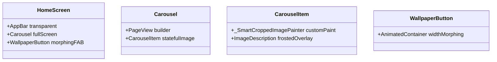

# UI/UX Specification & Agent Directive: **Daily Wallpaper**

This document defines the visual system, UI/UX philosophy, and screen layout directives for the **Daily Wallpaper** application. It is specifically structured as an **Agent-Readable Design System** to guide future coding agents in generating, modifying, or iterating on the application's user interface without breaking its core visual intent.

---

## 1. Core Product & UX Philosophy: **"The Invisible UI"**

*   **Product Name:** `Daily Wallpaper`
*   **Tagline:** *A feature-rich daily wallpaper application built with Flutter that provides high-quality images from multiple sources every day.*
*   **Core UI Directive:** **The wallpaper is the interface.** The UI must remain entirely out of the user's way to maximize visual focus on high-resolution daily space photography, curated shots, and category-filtered images. 

### A. Non-Negotiable UX Rules
1.  **Fullscreen Immersive Overlay:** The wallpaper must always bleed edge-to-edge under the system status bar and navigation bar. System overlays must be fully transparent.
2.  **Frosted-Glass Transitions (Glassmorphism):** Information overlays, metadata descriptions, and dialog cards must use translucent backdrops with heavy blurring. This ensures high readability while allowing the underlying wallpaper shapes and colors to glow through.
3.  **Zero-Elevation Footprint:** Floating controls, AppBars, and dialog sheets must avoid solid borders or harsh drop-shadow elevations (use `elevation: 0.0` or flat layout styles).
4.  **Dynamic Morphing Actions:** Interaction buttons (like the `WallpaperButton`) must scale or morph in shape to communicate processing states (like background crop analysis) rather than covering the screen with blocking loader overlays.

---

## 2. Visual Identity & Token Specifications (Codebase-Inherited)

Coding agents must reuse these precise visual tokens when generating style structures:

### A. Core Color Tokens
```dart
// Primary Palette
Colors.black            // Primary background for Scaffold and error panels to save power
Colors.white            // Dominant text and iconography color
Colors.lightBlue        // Primary accent highlight color (Active FAB, positive selections)

// Translucent & Overlay Neutrals
Color.fromRGBO(0, 0, 0, 0.8)       // Translucent dark system overlay (StatusBar / SystemNavBar)
Colors.black.withValues(alpha: 0.3) // Soft card background tint
Colors.black.withValues(alpha: 0.5) // Medium contrast backdrop overlay
Colors.white.withValues(alpha: 0.3) // Inactive borders & dividers

// Status Colors (Crop Quality Indicator Levels)
Colors.grey             // Level 0: Off
Colors.green            // Level 1: Conservative / Success State
Colors.blue             // Level 2: Balanced
Colors.orange           // Level 3: Aggressive / ML Warning
```

### B. Glassmorphism Design Token
```dart
// Frost Blur Equation (Standardised in description and detail cards)
ImageFilter.blur(
  sigmaX: 50.0,
  sigmaY: 50.0,
)
```

### C. Typography System
Titles and metadata must use these exact sizing constraints to maintain scale harmony:
*   **Wallpaper Source Title (AppBar):** `fontSize: 20.0`, `fontWeight: FontWeight.w500` with high-contrast text drop-shadow:
    ```dart
    shadows: [
      Shadow(
        offset: const Offset(1.0, 1.0),
        blurRadius: 3.0,
        color: Colors.black.withValues(alpha: 0.5),
      ),
    ]
    ```
*   **Header Labels (Settings Panel):** `fontSize: 18.0`, `fontWeight: FontWeight.bold`
*   **Settings Titles & switch captions:** `fontSize: 18.0`
*   **Button labels / Indicators:** `fontSize: 13.0` or `14.0`, `fontWeight: FontWeight.w500`

---

## 3. Screen Layout & Component Directives

Future UI generation tasks must conform to the following modular blueprints.



### Screen 1: HomeScreen (The Active Daily Wallpaper Catalog)
This screen is the primary interaction point. It displays today's images in an edge-to-edge sliding view.

#### 1. AppBar Structure
*   **Style:** Fully transparent (`backgroundColor: Colors.transparent`, `elevation: 0.0`).
*   **Title:** Dynamically displays the `source` field of the active `ImageItem` (e.g., "NASA" or "Bing").
*   **Action Controls:**
    *   **Info Button (`Icons.info_outline`):** Calls `_showImageInfo()` to display a bottom modal sheet containing licensing and photographer credits.
    *   **More Options Popup Menu (`Icons.more_vert`):** Includes:
        1.  `crop_info` $\rightarrow$ "Crop Analysis" (`Icons.center_focus_strong`)
        2.  `/settings` $\rightarrow$ "Settings" (`Icons.settings`)
        3.  `/older` $\rightarrow$ "History" (`Icons.history`)

#### 2. Body: Edge-to-Edge Carousel (`Carousel`)
*   Uses a `PageView.builder` to allow horizontal swipe navigation.
*   Uses `CarouselItem` as the slide wrapper.
*   **Anti-Flicker Layout Guard:** PageView builder must be wrapped in a `LayoutBuilder` checking that dimensions are greater than zero to prevent page-zero resets during Android GL surface changes:
    ```dart
    if (constraints.maxWidth == 0 || constraints.maxHeight == 0) {
      return const SizedBox.shrink();
    }
    ```

#### 3. Slide Item (`CarouselItem`)
*   Contains two overlapping layers in a `Stack`:
    *   **Layer 1 (Background):** Standard cover image loaded from `localSourcePath` or `url` using `BoxFit.cover`. Decodes to exact device size (`cacheWidth`/`cacheHeight`) to save RAM.
    *   **Layer 2 (Foreground):** The custom smart-cropped image (`_SmartCroppedImagePainter`) rendering through a canvas `drawImageRect`, smoothly fading in via `AnimatedOpacity` (`duration: 600ms`) once background cropping is complete.
*   **Information Plate (`ImageDescription`):** Positioned at the bottom. Consists of a frosted-glass overlay containing the wallpaper `description` and the `copyright` (rendered with dynamic `TextWithHyperLink`).

#### 4. Morphing Interaction Trigger (`WallpaperButton`)
A floating action button positioned at the bottom center that morphs shapes depending on the BLoC state:
*   **Normal State:** Circle (`width: 70`, `height: 60`), light blue background, icon `Icons.wallpaper`.
*   **Processing / Loading State:** Pill shape (`width: 220`, `height: 60`), semi-transparent black background, containing a small `CircularProgressIndicator` and a text label "Analysis in progress...".
*   **Wallpaper Applying State:** Box with border radius `15.0`, colored in deep `Colors.blue` with a circular loading progress spinner.
*   **Success Confirmation State:** Solid green box (`Colors.green`) with large `Icons.done` icon showing for 1.5 seconds.

---

### Screen 2: HistoryScreen (The Date-Selector Archive)
A chronological grid page displaying downloaded wallpaper history.
*   Reuses the `Carousel` and `CarouselItem` classes to guarantee visual continuity between Home and History viewports.
*   Includes `history_empty_state.dart` (showing a minimal error illustration and a "Go to Home" button) and `history_error_state.dart` (showing retry buttons).
*   **Navigation Bridge:** Floating actions on History must trigger `HistoryEventIndexChanged` dynamically so adjacent historical wallpapers are preloaded.

---

### Screen 3: SettingsScreen (Minimal Preferences Panel)
A structured list view for adjusting parameters, prioritizing clean switches and compact sliders.
*   **Settings Scaffolding:** Uses transparent AppBars and simple dividers to keep visual noise low.
*   **Crop Level Configurator (`SmartCropQualitySlider`):** Renders a custom slider mapping the integer crop quality scale (0 to 3) to the appropriate status colors (Grey, Green, Blue, Orange).
*   **ML Engine Status Container:** A styled grey box (`Colors.grey[100]`) with border radius `8.0` detailing:
    *   Brain icon (`Icons.psychology`) dynamically colored based on capability status.
    *   Text labels indicating whether subject detection is running actively or is in simulated mode.

---

## 4. UI-to-Codebase Terminology & Localization Binds

Coding agents must strictly bind localization tags in generated widgets using `AppLocalizations`:

| Screen Element / Label | Localization Path (`l10n.dart`) | Native English Text (`app_en.arb`) |
| :--- | :--- | :--- |
| Wallpaper Button Loader | `l10n.analysisInProgress` | `"Analysis in progress..."` |
| Settings Category | `l10n.settings` | `"Settings"` |
| Settings Lock Switch | `l10n.setLockScreenWallpaper` | `"Set lock screen wallpaper"` |
| Settings Lock Caption | `l10n.applyWallpaperToLockScreen` | `"Apply wallpaper to lock screen"` |
| Settings Source Option | `l10n.bingRegion` | `"Bing region"` |
| Settings Source Caption | `l10n.selectPreferredRegion` | `"Select your preferred region for Bing images"` |
| Crop Detail Dialog Title | `l10n.cropAnalysis` | `"Crop Analysis"` |
| ML Status Header | `l10n.mlEngineStatus` | `"ML Engine Status"` |
| Toast Success Prompt | `l10n.wallpaperSetSuccess` | `"Wallpaper set successfully"` |
| Toast Failure Prompt | `l10n.failedToSetWallpaper` | `"Failed to set wallpaper"` |

---

## 5. Agent Instructions for Generating UI Modifications

When a coding agent is tasked with adding elements, updating layouts, or modifying buttons on this codebase, the agent **MUST** satisfy these five architectural directives:

1.  **Do Not Invent Styling Colors:** Only use colors defined in `Visual Identity (Section 2)`. Never introduce brand-specific background colors (e.g., solid reds, yellows, or neon overlays) that compete with the wallpaper graphics.
2.  **Implement Transparent Scaffold Backdrops:** Ensure any newly created screen scaffolds feature:
    ```dart
    extendBodyBehindAppBar: true,
    backgroundColor: Colors.transparent, // Or Colors.black for empty states
    ```
3.  **Check Dimensions in LayoutBuilders:** To prevent widget resets during Android Impeller frame lifecycle changes, always wrap carousels or swipe widgets in `LayoutBuilder` blocks that verify constraints are greater than zero before mounting.
4.  **Enforce Safe Memory Image Loading:** When introducing image-loading widgets (from files or URLs), coding agents must scale the image decode sizes using physical screen device pixels to prevent heavy 4K wallpapers from leaking RAM memory:
    ```dart
    final size = MediaQuery.of(context).size;
    final pixelRatio = MediaQuery.of(context).devicePixelRatio;
    
    Image.file(
      File(localSourcePath),
      cacheWidth: (size.width * pixelRatio).round(),
      cacheHeight: (size.height * pixelRatio).round(),
    );
    ```
5.  **Maintain Decoupled BLoC Actions:** Presentation UI widgets must never execute direct network calls, write DB parameters, or trigger ML segments directly. They must exclusively emit events to the BLoC provider (e.g., `context.read<HomeBloc>().add(const HomeEvent.wallpaperUpdateRequested())`).
