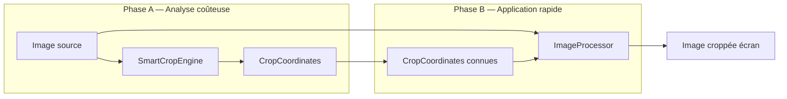
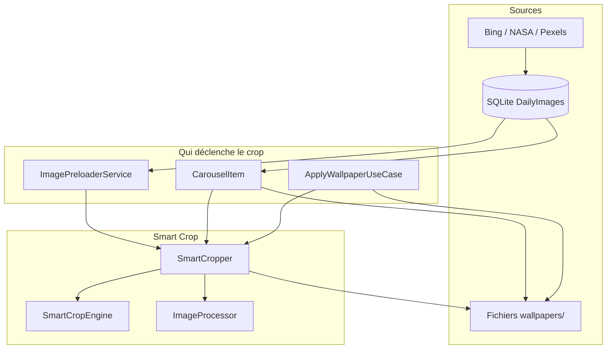
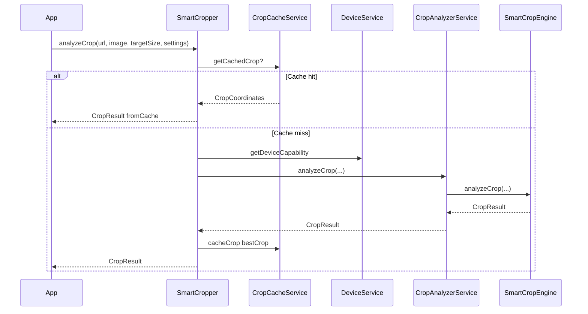
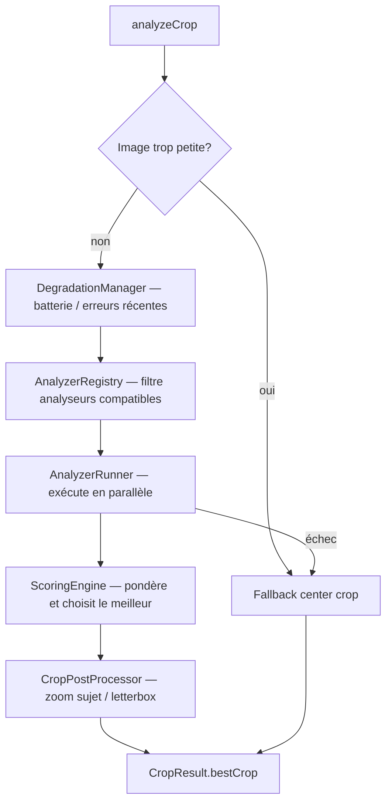
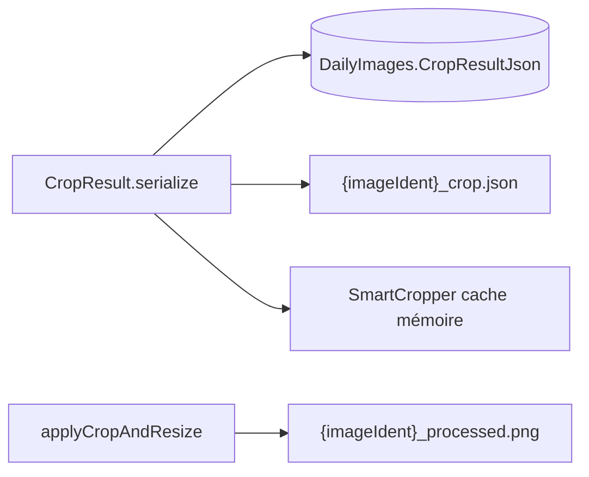
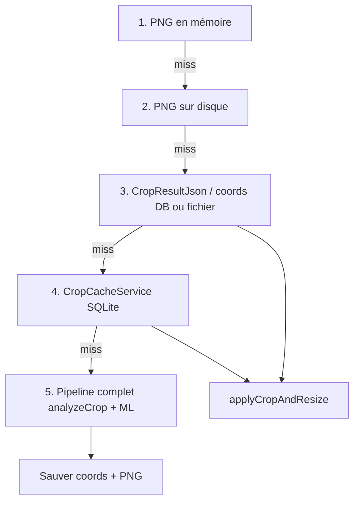

# Smart Crop — Vue d'ensemble

Document **haut niveau** complémentaire à [ARCHITECTURE.md](ARCHITECTURE.md).  
L'architecture générale de l'app (BLoC, sources d'images, History) y est décrite ; ici on se concentre sur **comment le Smart Crop décide où couper une image** et **comment cette décision est réutilisée**.

Code principal : `lib/features/smart_crop/`

---

## 1. Problème résolu

Les wallpapers (Bing, NASA, Pexels) arrivent souvent en **paysage** ou en ratio différent de l'écran du téléphone. Un simple « centrer et couper » peut tronquer un visage ou le sujet principal.

Le Smart Crop :

1. **Analyse** l'image avec plusieurs stratégies (composition, visages, sujet ML, etc.).
2. Choisit un rectangle de crop **normalisé** (`x`, `y`, `width`, `height` entre 0 et 1).
3. **Applique** ce rectangle puis redimensionne pour l'écran.
4. **Persiste** le résultat pour ne pas refaire l'analyse à chaque affichage.

---

## 2. Les deux phases (idée centrale)



| Phase | Durée typique | ML / analyseurs | Quand |
|-------|---------------|-----------------|--------|
| **A — Analyse** | ~0,5–3 s | Oui (dont ML Kit pour le sujet) | Première fois pour une image + réglages donnés |
| **B — Application** | ~millisecondes | Non (canvas + resize) | Cache hit, coords en DB, ou PNG déjà sur disque |

**Règle produit (plan en cours)** : la phase A ne doit tourner **qu'une fois** par image ; ensuite on ne fait que la phase B tant que les coordonnées existent.

---

## 3. Parcours dans l'application



| Point d'entrée | Rôle |
|----------------|------|
| **ImagePreloaderService** | Télécharge la source ; peut lancer le crop en arrière-plan avant l'affichage du carousel |
| **CarouselItem** | Affiche l'image ; si pas de PNG cache, appelle `SmartCropper.processImage()` |
| **ApplyWallpaperUseCase** | Applique le fond d'écran ; préfère bytes WYSIWYG ou PNG disque, sinon crop depuis coords |

---

## 4. Pipeline interne (`SmartCropper`)

Point d'entrée façade : [`SmartCropper`](lib/features/smart_crop/smart_cropper.dart).

### 4.1 Analyse seule — `analyzeCrop()`



### 4.2 Pipeline complet — `processImage()`

```
analyzeCrop()  →  bestCrop (CropCoordinates)
       ↓
applyCropAndResize(source, bestCrop, targetSize)  →  ui.Image affichable
```

C'est ce que appellent aujourd'hui le preloader et `CarouselItem` quand aucun cache n'existe.

---

## 5. Moteur d'analyse (`SmartCropEngine`)

Orchestrateur : [`smart_crop_engine.dart`](lib/features/smart_crop/engine/smart_crop_engine.dart).



### Analyseurs enregistrés (stratégies)

Chaque analyseur propose un ou plusieurs `CropScore` (rectangle + score + métriques).

| Analyseur | Idée |
|-----------|------|
| `FaceDetectionCropAnalyzer` | Centrer sur les visages détectés |
| `ObjectDetectionCropAnalyzer` | Objets saillants |
| `BirdDetectionCropAnalyzer` | Oiseaux (niche) |
| `SubjectDetectionCropAnalyzer` | Sujet sans ML lourd |
| `MlSubjectCropAnalyzer` | Segmentation ML Kit (TFLite) — le plus coûteux |
| `LandscapeAwareCropAnalyzer` | Horizons / paysages |
| `RuleOfThirdsCropAnalyzer` | Composition tiers |
| `CenterWeightedCropAnalyzer` | Crop conservateur centré |
| `EntropyBasedCropAnalyzer` | Zones à fort détail |
| `EdgeDetectionCropAnalyzer` | Contours forts |

Le **ScoringEngine** combine score brut × poids de l'analyseur × réglage d'agressivité, puis le **CropPostProcessor** peut ajuster (ex. zoom pour inclure le sujet, bandes letterbox).

---

## 6. Modèle de données

### `CropCoordinates` (ce qui compte pour recropper)

Coordonnées **normalisées** (0.0–1.0) par rapport à l'image source :

- `x`, `y` — coin supérieur gauche du crop  
- `width`, `height` — taille du rectangle  
- `confidence`, `strategy` — métadonnées pour l'UI  
- `subjectBounds` (optionnel) — boîte du sujet pour le dialog d'info  

### `CropResult` (résultat complet d'une analyse)

Contient `bestCrop` plus l'historique (`allScores`, `scoringBreakdown`, métriques de perf).  
**Pour réafficher ou recropper**, seul `bestCrop` est strictement nécessaire ; le reste sert au debug et au dialog « Crop info ».

### Persistance



| Couche | Contenu | Durée typique |
|--------|---------|----------------|
| Mémoire (`getProcessedImage`) | `ui.Image` croppée | Session app |
| Disque PNG | Pixels croppés | ~2 jours (cleanup fichiers) |
| SQLite `CropResultJson` | Coords + métadonnées analyse | ~30 jours (lignes DB) — **coords à conserver après cleanup fichiers** (plan) |
| `crop_cache.db` | Cache coords par URL + taille + settings | Variable |

---

## 7. Hiérarchie de résolution (cible produit)

Ordre idéal avant de relancer la phase A (détaillé dans [plan.md](../plan.md)) :



Aujourd'hui, plusieurs chemins (preloader, carousel) exigent parfois **PNG + JSON ensemble** ou sautent directement à l'étape 5 — le plan introduit `CropImageResolver` pour unifier ce comportement.

---

## 8. Réglages utilisateur

- **Activation** : `SmartCropPreferences.isSmartCropEnabled()` (SharedPreferences).
- **Profil** : `CropSettings` — agressivité, stratégies on/off, timeouts, letterbox, scaling sujet.
- **Taille cible** : calculée via `ScreenUtils` (ratio physique de l'écran).

Si Smart Crop est désactivé, l'app affiche l'image source sans analyse.

---

## 9. Performance et garde-fous

| Mécanisme | Rôle |
|-----------|------|
| `DeviceService` / `DegradationManager` | Réduit analyseurs ou qualité sur appareil faible ou après erreurs |
| `BatteryOptimizer` | Allège le traitement si batterie basse |
| Verrou ML (`MlSubjectCropAnalyzer`) | Un seul passage ML à la fois |
| Plan : `Isolate.run` pour ML Kit | Évite conflit Vulkan Impeller / TFLite sur le UI thread |
| Fallbacks | Center crop si timeout, erreur ou image trop petite |

---

## 10. Fichiers clés (carte rapide)

```
lib/features/smart_crop/
├── smart_cropper.dart          # Façade : analyzeCrop, processImage, applyCropAndResize
├── engine/
│   ├── smart_crop_engine.dart  # Orchestration analyseurs
│   ├── scoring_engine.dart     # Choix du meilleur score
│   ├── crop_post_processor.dart
│   └── analyzer_runner.dart
├── analyzers/                  # Une stratégie par fichier
├── services/
│   ├── crop_analyzer_service.dart
│   ├── image_processor.dart    # Phase B — canvas
│   └── crop_cache_service.dart
└── models/
    ├── crop_coordinates.dart
    ├── crop_result.dart
    └── crop_settings.dart
```

---

## 11. Liens

- [ARCHITECTURE.md](ARCHITECTURE.md) — structure globale de l'app  
- [plan.md](../plan.md) — correctifs perf, `CropImageResolver`, rétention coords vs fichiers  
- [lib/features/smart_crop/README.md](../lib/features/smart_crop/README.md) — référence API / usage développeur (plus détaillé, orienté code)
