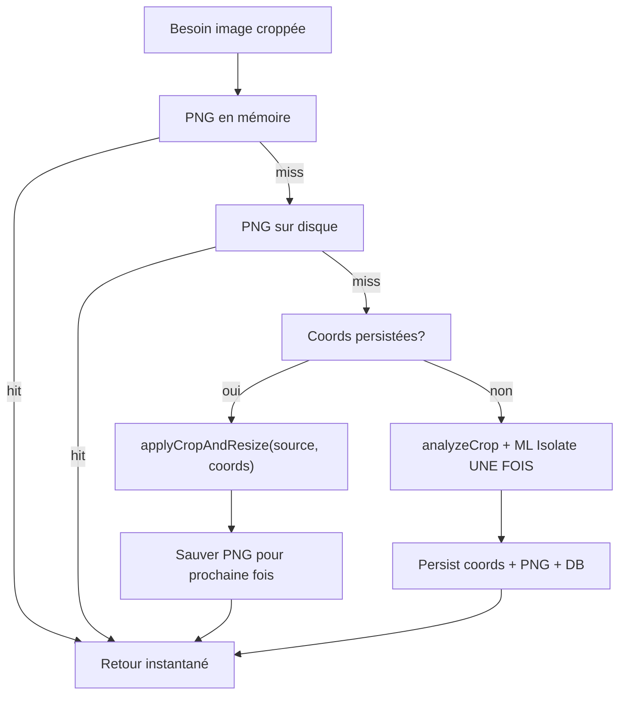
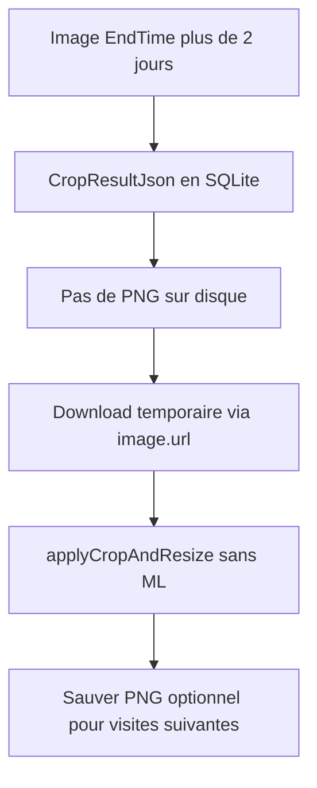
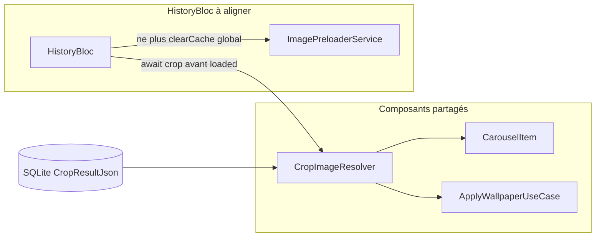

# Plan : Correction des 3 Bugs de Performance + Analyse Unique du Smart Crop (v3)

> **Document unique de référence** — toutes les décisions, diagnostics, changements proposés, tests et validation sont ici. Ne pas maintenir de copie parallèle ailleurs.

---

## Contexte & Décisions Confirmées

- **Q1 (ML Kit)** : `MlSubjectCropAnalyzer` désactivé dans le preloader background. Activé uniquement dans le pipeline SmartCrop on-demand, exécuté dans un `Isolate.run()`.
- **Q2 (NASA/Bing)** : Cache-first conservé. `ImagePreloaderService` doit terminer le téléchargement local **ET** le smart crop de l'image courante avant que `CarouselItem` soit affiché. Le processing se fait une seule fois, en arrière-plan, séquentiellement.
- **Q3 (Analyse unique)** : Une fois que le pipeline d'analyse a produit des `CropCoordinates` pour une image, ces coordonnées sont la source de vérité. Le pipeline ML + analyseurs ne doit **jamais** tourner deux fois pour la même image (sauf invalidation explicite : refresh forcé, changement de settings majeur).
- **Q4 (Rétention disque)** : Nettoyage fichiers à 2 jours — supprimer PNG/source sur disque et mettre `LocalSourcePath` / `LocalProcessedPath` à `NULL`. **`CropResultJson` reste en SQLite`** pour permettre re-download + `applyCropAndResize` sans ré-analyse (History, NASA, etc.).

---

## Diagnostic Final

### Bug #1 — Wallpaper bloqué "éternellement"

Le fallback final dans `ApplyWallpaperUseCase.call()` appelle `setBothWallpaper(image.url)` ou `setSystemWallpaper(image.url)`. Le plugin `setwallpaper` re-télécharge lui-même l'image depuis le réseau, sans timeout contrôlé. Sur une NASA image de plusieurs Mo sur une connexion lente, ça devient "éternel".

### Bug #2 — ML Kit lag + crash

`MlSubjectCropAnalyzer._runAnalysis()` exécute `image.toByteData()` (codec) + TFLite (via ML Kit) directement sur le UI isolate. Même avec `await Future.delayed(Duration.zero)`, ces opérations ne cèdent pas suffisamment. GPU Vulkan d'Impeller et TFLite entrent en conflit.

### Bug #3 — NASA/Bing spinner à chaque navigation

**Cause racine précise :** Le smart crop a été volontairement retiré du `ImagePreloaderService` (voir commentaire ligne 131-134) à cause du conflit Vulkan/ML Kit. En conséquence :

- Le preloader ne fait que télécharger la source brute sur disque.
- `CarouselItem._getOrProcessSmartCroppedImage()` trouve `localProcessedImage == null` (jamais créée), et exécute le **full smart crop pipeline sur le UI thread** à chaque affichage de l'image.
- Il sauvegarde bien le résultat sur disque... mais seulement **après** le processing visible par l'utilisateur.
- Au prochain lancement de l'app, le cache disque est là (chemin rapide). Mais lors du premier affichage ou après un refresh, le spinner revient.

**La vraie solution :** Maintenant que ML Kit tourne dans un `Isolate.run()` (Bug #2), **réactiver le smart crop dans le background preloader**. L'image traitée est sauvegardée sur disque. Quand `CarouselItem` s'affiche, il lit depuis le disque → instantané.

---

## Principe Transversal : `CropCoordinates` comme Source de Vérité

> [!IMPORTANT]
> **Règle fondamentale :** Une fois que le pipeline d'analyse a produit des `CropCoordinates` pour une image, ces coordonnées DOIVENT être persistantes et DOIVENT être consultées en priorité partout avant de relancer l'analyse. Le pipeline ML + analyseurs ne doit **jamais** tourner deux fois pour la même image.

### Modèle de données

Les coordonnées sont dans [`CropCoordinates`](lib/features/smart_crop/models/crop_coordinates.dart) : `x`, `y`, `width`, `height` (normalisées 0–1), plus `confidence`, `strategy`, `subjectBounds`.

### Infrastructure existante

- `CropCoordinates` est entièrement sérialisable (`toJson()` / `fromJson()`)
- `CropResult.serialize()` / `deserialize()` est implémenté
- `cropResultJson` est stocké dans `ImageItem` ET dans SQLite (`DatabaseHelper.updateImagePaths`)
- Fichier disque `{imageIdent}_crop.json` via [`ImageCacheServiceImpl`](lib/services/image_cache_service.dart)
- `SmartCropper.applyCropAndResize(source, coords, targetSize)` peut appliquer des coordonnées **sans analyse**
- `CropCacheService.getCachedCrop()` (SQLite, clé = URL + targetSize + settings) est déjà consulté dans `SmartCropper.analyzeCrop()`

### Lacunes actuelles (code réel)

| Composant | Problème |
|---|---|
| [`image_preloader_service.dart`](lib/services/image_preloader_service.dart) `_processImageWithSmartCrop` | Exige **PNG ET** JSON crop ensemble (L218). Si PNG supprimé mais coords présentes → `processImage()` = ré-analyse complète. |
| [`carousel_item.dart`](lib/widgets/carousel_item.dart) `_getOrProcessSmartCroppedImage` | Même bug (L107). Ne consulte pas `image.cropResultJson` (SQLite) si le fichier `_crop.json` manque. Appelle toujours `processImage()` en fallback. |
| [`apply_wallpaper.dart`](lib/features/wallpaper/domain/usecases/apply_wallpaper.dart) | Utilise `getCachedCrop()` (SQLite crop cache) mais pas `image.cropResultJson` ; fallback L100 = `processImage()` = ré-analyse au tap wallpaper. |

### Hiérarchie de résolution (uniforme partout)

```
1. Image PNG traitée en mémoire (SmartCropper.getProcessedImage)
2. Image PNG traitée sur disque (imageCache.loadProcessedImage)
   ↓ (si manquante)
3. CropCoordinates (dans cet ordre) :
   - image.cropResultJson (ImageItem / SQLite)
   - imageCache.loadCropResultJson(imageIdent) (fichier JSON disque)
   - SmartCropper.getCachedCrop(url, targetSize, settings) (SQLite)
   → applyCropAndResize(source, savedCoords, targetSize)  ← COURT-CIRCUIT : pas d'analyse !
   → Sauvegarder le PNG résultant sur disque pour la prochaine fois
   ↓ (si coordonnées aussi manquantes)
4. Pipeline d'analyse complet (SmartCropEngine + ML Kit dans Isolate)  ← UNE SEULE FOIS
   → Persister les coordonnées (SQLite + JSON disque + PNG disque + ImageItem)
```

### Comportement attendu (flux)



**Coût CPU :** `applyCropAndResize` = canvas + resize (~ms). Pipeline complet = analyseurs + ML Kit (~secondes). L'objectif est d'éliminer tout re-passage inutile du pipeline complet.

---

## Politique de rétention : fichiers 2 jours, coordonnées conservées

> [!IMPORTANT]
> **Décision produit :** Le nettoyage à 2 jours libère l'espace disque (fichiers image). Les **`CropCoordinates` restent en SQLite** (`CropResultJson`) tant que l'enregistrement existe (jusqu'à ~30 jours en DB). Seuls les **chemins locaux** sont mis à `NULL` parce que les fichiers n'existent plus — pas parce que le crop n'est plus valide.

### Comportement actuel (à corriger)

[`cleanupOldFilesAndReferences`](lib/core/database/database_helper.dart) efface aujourd'hui **à tort** aussi `CropResultJson` :

```sql
-- ACTUEL (incorrect)
UPDATE DailyImages SET LocalSourcePath = NULL, LocalProcessedPath = NULL, CropResultJson = NULL ...
```

[`cleanupOldWallpapers`](lib/services/image_cache_service.dart) supprime les fichiers du dossier `wallpapers/` par date de modification (> 2 jours) — OK pour `_source`, `_processed.png`, et éventuellement `{ident}_crop.json` sur disque (redondant si la DB garde le JSON).

### Comportement cible

| Ressource | Après 2 jours | Raison |
|---|---|---|
| Fichiers `_source` / `_processed.png` | Supprimés du disque | Économie d'espace |
| `LocalSourcePath`, `LocalProcessedPath` en DB | `NULL` | Les fichiers pointés n'existent plus |
| **`CropResultJson` en DB** | **Conservé** | Source de vérité pour re-crop sans ML |
| Colonne `Url` (NASA / Bing / Pexels) | Conservée | Re-téléchargement temporaire à la demande |
| Fichier `{ident}_crop.json` sur disque | Peut être supprimé (optionnel) | Le resolver lit d'abord `image.cropResultJson` depuis SQLite |

### Flux History / image > 2 jours (après fix cleanup)



- **NASA / Bing / Pexels :** re-download via `image.url` en DB (NASA APOD en général stable ; fallback API `fetchNASAByDate` hors scope initial — voir note History).
- **Pas d'analyse ML** si `cropResultJson` est encore présent — exactement le cas d'usage du `CropImageResolver` étape 3.
- **Analyse complète** uniquement si l'image n'a **jamais** été analysée (`CropResultJson` absent).

#### [MODIFY] [`database_helper.dart`](lib/core/database/database_helper.dart)

- `cleanupOldFilesAndReferences()` :
  - Supprimer les fichiers physiques source + processed (inchangé).
  - **Ne plus** mettre `CropResultJson = NULL` dans l'`UPDATE`.
  - SQL cible : `UPDATE DailyImages SET LocalSourcePath = NULL, LocalProcessedPath = NULL WHERE EndTime < ...`
  - Ne pas supprimer le fichier `_crop.json` dans la boucle **ou** le supprimer uniquement pour l'espace disque (la DB reste autoritative).

#### Tests cleanup

- **NOUVEAU** : `'cleanupOldFilesAndReferences preserves CropResultJson when clearing local paths'`
- **NOUVEAU** : `'cleanupOldFilesAndReferences nullifies LocalSourcePath and LocalProcessedPath for old images'`

---

## Changement Architectural : `CropImageResolver` (point d'entrée unique)

**Problème :** La hiérarchie ci-dessus est dupliquée (ou devrait l'être) dans 3 fichiers — risque d'incohérence.

**Solution :** Un seul service qui encapsule toute la logique.

#### [NEW] [`crop_image_resolver.dart`](lib/features/smart_crop/services/crop_image_resolver.dart)

```dart
class CropImageResolver {
  /// Retourne l'image croppée + met à jour ImageItem (smartCropResult, paths, cropResultJson).
  Future<CropResolveResult> resolve({
    required ImageItem image,
    required ui.Image sourceImage,
    required ui.Size targetSize,
    required CropSettings settings,
    ImageCacheService? imageCache,
  });
}
```

**Refactor des consommateurs** — remplacer la logique inline par `CropImageResolver.resolve()` :

- [`image_preloader_service.dart`](lib/services/image_preloader_service.dart) — `_processImageWithSmartCrop`
- [`carousel_item.dart`](lib/widgets/carousel_item.dart) — `_getOrProcessSmartCroppedImage`
- [`apply_wallpaper.dart`](lib/features/wallpaper/domain/usecases/apply_wallpaper.dart) — path fallback coords (#3)

**Obligation transversale :** lors d'un hit coords (étape 3), hydrater `image.smartCropResult` depuis `cropResultJson` pour que [`CropInfoDialog`](lib/widgets/crop_info_dialog.dart) fonctionne sur Home **et** History.

`SmartCropper.processImage()` reste public pour tests/outils (`crop_inspector`) mais **plus appelé directement** depuis UI / preloader / wallpaper.

---

## Proposed Changes

### Bug #2 — ML Kit dans un Isolate (À faire en PREMIER — déblocant)

Le fix du Bug #2 est la **dépendance** qui débloque le fix du Bug #3. Le pipeline complet (étape 4 du résolveur) bénéficie automatiquement de l'isolate ; les étapes 1–3 (coords connues) **ne touchent jamais ML Kit**.

#### [NEW] [`ml_isolate_runner.dart`](lib/features/smart_crop/analyzers/ml/ml_isolate_runner.dart)

Nouveau fichier contenant les types sérialisables et la fonction top-level pour l'isolate.

```dart
// Types transmissibles entre isolates (pas de ui.Image, pas de File object)
class MlIsolatePayload {
  final Uint8List pngBytes;       // image encodée avant envoi
  final int originalWidth;
  final int originalHeight;
  final String tempDirPath;       // passé en paramètre (pas path_provider dans l'isolate)
}

class MlIsolateResult {
  final double? subjectX, subjectY, subjectWidth, subjectHeight;
  final double confidence;
  final String? error;
}

// Fonction TOP-LEVEL (exigence dart:isolate)
Future<MlIsolateResult> runMlSegmentationInIsolate(MlIsolatePayload payload) async {
  // 1. Écrire les bytes en fichier temp dans l'isolate
  // 2. Créer SubjectSegmenter, appeler processImage()
  // 3. Appeler MlSubjectDetector.detectFromMask()
  // 4. Retourner MlIsolateResult (types primitifs seulement)
  // 5. Supprimer le fichier temp
}
```

**Contraintes techniques :**

- `ui.Image` n'est PAS transmissible entre isolates → encodage PNG en `Uint8List` dans le UI isolate avant l'appel.
- `path_provider` ne fonctionne pas dans un isolate secondaire → le chemin `tempDir` est passé en paramètre.
- `MlSegmentationServiceImpl` est instancié **à l'intérieur** de l'isolate (pas transmissible).

#### [MODIFY] [`ml_subject_crop_analyzer.dart`](lib/features/smart_crop/analyzers/ml_subject_crop_analyzer.dart)

- Dans `_runAnalysis()` : encoder l'image en `Uint8List` (PNG) via `image.toByteData()`.
- Appeler `Isolate.run(() => runMlSegmentationInIsolate(payload))` avec un timeout de 4s.
- Reconstruire le `CropScore` à partir du `MlIsolateResult` dans le UI isolate.
- Conserver le verrou statique `_isAnalyzing` — un seul isolate ML à la fois.
- Retirer `_toInputImage()` de l'analyzeur (déplacé dans l'isolate runner).

---

### Bug #3 — Smart Crop background réactivé (dépend du fix Bug #2)

#### [MODIFY] [`image_preloader_service.dart`](lib/services/image_preloader_service.dart)

**Réactivation du smart crop en background** maintenant que ML Kit est safe dans un isolate :

- `_preloadSingleImage()` : après le download source, **appeler `_enqueuePreprocessing()`** (déjà présente mais jamais appelée).
- `_processImageWithSmartCrop()` : **déléguer à `CropImageResolver.resolve()`** (hiérarchie uniforme, court-circuit coords).
- Exposer **`preloadCurrentImageWithCrop(ImageItem)`** : awaitable par le BLoC pour l'image courante.

**Ordre de processing séquentiel (déjà géré par `_processingLock`)** :

1. Image courante (index actuel) — awaité par le BLoC
2. Image suivante (index +1) — background
3. Image précédente (index -1) — background
4. Reste — background par distance

#### [MODIFY] [`image_preloader.dart`](lib/services/image_preloader.dart) (interface)

Exposer `preloadCurrentImageWithCrop()`.

#### [MODIFY] [`home_bloc.dart`](lib/features/wallpaper/bloc/home_bloc.dart)

Dans `_onStarted()`, après avoir émis les fresh images :

- Await `_preloaderService.preloadCurrentImageWithCrop(freshImages[indexToUse])` **avant** l'émission finale de `HomeState.loaded`.
- Timeout de 8s pour ne pas bloquer indéfiniment si le smart crop échoue.
- Les autres images continuent en background via `unawaited(preloadImages(...))`.

#### [MODIFY] [`carousel_item.dart`](lib/widgets/carousel_item.dart)

- `_getOrProcessSmartCroppedImage()` : déléguer à `CropImageResolver.resolve()`.
- **Supprimer le `Future.delayed(300ms)`** artificiel (compensait le manque de préchargement).
- **`_captureRenderedImage()`** : remplacer `Future.delayed(500ms, callback)` par `SchedulerBinding.instance.addPostFrameCallback()` (safe Impeller).

---

### Bug #1 — Wallpaper : Simplifier `ApplyWallpaperUseCase`

**Principe directeur :** À l'instant où l'utilisateur appuie sur "Set Wallpaper", les images du carousel sont **déjà téléchargées ET croppées sur disque** (grâce au fix Bug #3). `ApplyWallpaperUseCase` n'a donc **pas à faire de SmartCrop complet** — il se contente de lire ce qui existe déjà.

#### [MODIFY] [`apply_wallpaper.dart`](lib/features/wallpaper/domain/usecases/apply_wallpaper.dart)

**Restructuration** — supprimer `SmartCropper.processImage()` et `setBothWallpaper(url)` de `call()`.

| Priorité | Source | Condition | Action |
|---|---|---|---|
| 1 | WYSIWYG bytes (carousel render) | Toujours tenté en premier | `_setWallpaperViaFile(bytes)` |
| 2 | Processed PNG sur disque | Si path #1 rate | `getProcessedImageBytes()` → `_setWallpaperViaFile()` |
| 3 | **CropCoordinates + source disque** | Si PNG manquant mais coords disponibles | `CropImageResolver` ou `applyCropAndResize(source, savedCoords)` → `setFromBytes` |
| 4 | Source brute sur disque | Si coords aussi manquantes (edge case) | Load source + `setBothWallpaperFromBytes()` sans crop |
| 5 | Download depuis URL | Rien sur disque (1er lancement / corruption) | Download (timeout 15s) + `setBothWallpaperFromBytes()` sans crop |
| ❌ | `SmartCropper.processImage()` | **SUPPRIMÉ** de cet usecase | Jamais de recrop on-demand ici |
| ❌ | `setBothWallpaper(url)` | **SUPPRIMÉ** | Jamais de download non-contrôlé |

> [!NOTE]
> Le path #3 utilise `CropResult.deserialize(image.cropResultJson)` pour extraire les `CropCoordinates` déjà calculées, charge la source depuis disque, et applique le crop géométriquement. Aucune analyse, aucun ML Kit.

Supprimer les dépendances inutilisées : `SmartCropperCacheAdapter`, `_getOptimizedCropSettings()`, etc.

> [!IMPORTANT]
> Garder l'import `SmartCropper` pour `applyCropAndResize()` uniquement (path #3). Imports `CropResult` / `CropCoordinates` pour la désérialisation.

---

## Écran History — Alignement avec Home (même pipeline, pas de régression)

L'écran History réutilise les **mêmes composants** que le Home : [`Carousel`](lib/widgets/carousel.dart) → [`CarouselItem`](lib/widgets/carousel_item.dart), singleton [`ImagePreloaderService`](lib/services/image_preloader_service.dart), [`ApplyWallpaperUseCase`](lib/features/wallpaper/domain/usecases/apply_wallpaper.dart). Les fixes transversaux (`CropImageResolver`, coords persistées, wallpaper) en bénéficient automatiquement, mais **History a des lacunes spécifiques** à corriger pour éviter une UX incohérente Home vs History.

### État actuel (risques identifiés)

| Point | Code actuel | Risque |
|---|---|---|
| Préchargement | [`HistoryBloc`](lib/features/history/bloc/history_bloc.dart) appelle `preloadImages(images, 0)` puis émet `loaded` **sans await** du crop | Spinner au changement de date / premier affichage, alors que Home attendra `preloadCurrentImageWithCrop` |
| `clearCache()` au `close()` | `HistoryBloc.close()` appelle `_preloaderService.clearCache()` | Vide le cache **singleton** partagé avec Home → images disposées, re-traitement au retour sur Home |
| Index preloader | Toujours index `0`, pas de preload au swipe carousel | Si plusieurs images le même jour, index 1+ non pré-croppées |
| `CropInfoDialog` | Lit `image.smartCropResult` en mémoire uniquement | Affiche « analyse en cours » si `cropResultJson` est en DB mais pas encore hydraté |
| Données historiques | `ImageItem.fromMap` charge `CropResultJson` / `LocalProcessedPath` depuis SQLite | OK pour le court-circuit coords — **si** le resolver consulte `image.cropResultJson` |
| Images > 2 jours | Fichiers supprimés, **`CropResultJson` conservé en DB** (après fix cleanup) | Re-download temporaire via `Url` + `applyCropAndResize` — **pas** de ré-analyse ML |



### Changements à appliquer

#### [MODIFY] [`history_bloc.dart`](lib/features/history/bloc/history_bloc.dart)

**Aligner sur `HomeBloc` pour le chargement d'une date :**

- Dans `_onStarted()` et `_onDateSelected()` :
  - Après `getImagesForDate()`, si la liste n'est pas vide :
    - `await _preloaderService.preloadCurrentImageWithCrop(images[0]).timeout(Duration(seconds: 8), onTimeout: ...)`
  - **Puis** émettre `HistoryState.loaded`.
  - En background : `unawaited(_preloaderService.preloadImages(images, 0))` pour les autres images de la date.
- **Supprimer `_preloaderService.clearCache()` dans `close()`** — aligné sur [`home_bloc.dart`](lib/features/wallpaper/bloc/home_bloc.dart) L224-231 qui documente explicitement pourquoi le cache singleton ne doit pas être vidé (même PID, `ui.Image` encore valides pour l'autre écran).
- **Optionnel (recommandé)** : exposer un event `HistoryEventIndexChanged` depuis [`history_screen.dart`](lib/features/history/screens/history_screen.dart) `_onChange` → rappeler `preloadImages(images, newIndex)` comme Home fait sur `HomeEventIndexChanged`.

#### [MODIFY] [`crop_image_resolver.dart`](lib/features/smart_crop/services/crop_image_resolver.dart) (rappel transversal)

Lors de la résolution via coords (étape 3 de la hiérarchie), **toujours hydrater** :

```dart
image.smartCropResult = CropResult.deserialize(cropResultJson);
// ou depuis bestCrop si déjà en mémoire
```

Cela corrige [`CropInfoDialog`](lib/widgets/crop_info_dialog.dart) sur History sans logique UI dédiée.

#### Pas de changement structurel requis

- [`history_screen.dart`](lib/features/history/screens/history_screen.dart) : garde `Carousel` + `HistoryWallpaperFab` — bénéficie de `CarouselItem` + `ApplyWallpaperUseCase` refactorés.
- [`HistoryMemoryManager`](lib/features/history/screens/history_memory_manager.dart) : tracking par date, pas de dispose réel des `ui.Image` — pas de conflit avec le plan.

### Validation History (manuelle, en plus du Home)

1. Ouvrir History → sélectionner une date déjà visitée sur Home → **affichage instantané** sans spinner (PNG ou coords sur disque).
2. Changer de date → spinner court pendant le preload, puis image croppée (pas d'analyse ML si coords existent).
3. **Date > 2 jours** (fichiers nettoyés, coords encore en DB) : download temporaire + crop géométrique, **aucun** passage ML dans les logs.
4. Menu crop info (icône) sur une image avec coords en DB → affiche stratégie/confiance, **pas** « analyse en cours ».
5. Set wallpaper depuis History → < 5s, même comportement que Home.
6. Home → History → retour Home : **pas** de clignotement / re-crop massif (vérifier que `clearCache()` n'est plus appelé).

---

## Fichiers Modifiés — Récapitulatif

```
lib/
├── features/smart_crop/
│   ├── analyzers/ml/
│   │   └── [NEW] ml_isolate_runner.dart              ← Bug #2
│   ├── analyzers/
│   │   └── [MODIFY] ml_subject_crop_analyzer.dart    ← Bug #2
│   └── services/
│       └── [NEW] crop_image_resolver.dart            ← Principe transversal
├── core/database/
│   └── [MODIFY] database_helper.dart                 ← Cleanup: garder CropResultJson
├── features/history/
│   └── bloc/
│       └── [MODIFY] history_bloc.dart                ← History (alignement Home)
├── features/wallpaper/
│   ├── bloc/
│   │   └── [MODIFY] home_bloc.dart                   ← Bug #3
│   └── domain/usecases/
│       └── [MODIFY] apply_wallpaper.dart             ← Bug #1
├── services/
│   ├── [MODIFY] image_preloader.dart                 ← Bug #3 (interface)
│   └── [MODIFY] image_preloader_service.dart         ← Bug #3
└── widgets/
    └── [MODIFY] carousel_item.dart                   ← Bug #3

test/
├── features/smart_crop/
│   ├── [NEW] ml_isolate_runner_test.dart             ← Bug #2
│   └── [NEW] crop_image_resolver_test.dart           ← Principe transversal
├── features/history/
│   └── bloc/
│       └── [MODIFY] history_bloc_test.dart           ← History
├── features/wallpaper/
│   ├── bloc/
│   │   └── [MODIFY] home_bloc_test.dart
│   └── usecases/
│       └── [MODIFY] apply_wallpaper_test.dart
└── services/
    └── [NEW/MODIFY] image_preloader_service_test.dart
├── core/database/
    └── [MODIFY] database_helper_cleanup_test.dart    ← ou test existant DB
```

---

## Tests Unitaires

### ① [NEW] [`crop_image_resolver_test.dart`](test/features/smart_crop/crop_image_resolver_test.dart)

- `'returns memory PNG without calling analyzeCrop'`
- `'applies saved coords when PNG missing but cropResultJson present'` — **cas critique**
- `'falls back to full pipeline only when no coords anywhere'`
- `'persists PNG after applyCropAndResize shortcut'`
- `'does not invoke MlSubjectCropAnalyzer when coords exist'` (mock analyzer call count = 0)

### ② [MODIFY] [`apply_wallpaper_test.dart`](test/features/wallpaper/usecases/apply_wallpaper_test.dart)

- **MODIFIER** : `'should set both wallpapers'` → `FakeImageCacheService` retourne un processed PNG → vérifie que `lastSetUrl` commence par `file://` (bytes via fichier, jamais URL HTTP).
- **MODIFIER** : `'should fallback to URL when carousel bytes are missing'` → renommer en `'should use processed disk PNG when WYSIWYG bytes are missing'`.
- **NOUVEAU** : `'should apply saved CropCoordinates when processed PNG missing'` — PNG absent, `cropResultJson` présent + source sur disque → `applyCropAndResize` sans pipeline d'analyse.
- **NOUVEAU** : `'should use raw source bytes when coords and PNG both missing (edge case)'`.
- **NOUVEAU** : `'should download and apply source bytes when nothing is on disk'`.
- **NOUVEAU** : `'should respect 15s download timeout on path #5'`.
- **SUPPRIMER** : tout test qui vérifie un appel à `SmartCropper.processImage()` depuis cet usecase.
- **NOUVEAU** : `'should NOT invoke full SmartCrop analysis pipeline regardless of cache state'`.

### ③ [MODIFY] [`home_bloc_test.dart`](test/features/wallpaper/bloc/home_bloc_test.dart)

- **MODIFIER** : `FakeImagePreloaderService` → exposer `preloadCurrentImageWithCropCallCount` et `lastPreloadedImage`.
- **NOUVEAU** : `'should await preloadCurrentImageWithCrop before emitting fresh loaded state'`.
- **NOUVEAU** : `'should emit loaded even if preloadCurrentImageWithCrop times out (8s)'`.

### ④ [NEW] [`ml_isolate_runner_test.dart`](test/features/smart_crop/ml_isolate_runner_test.dart)

- `'MlIsolatePayload should be transmissible (only primitive types)'`
- `'runMlSegmentationInIsolate should return error result when ML Kit throws'`
- `'MlSubjectCropAnalyzer: _isAnalyzing reset to false after isolate completes'`
- `'MlSubjectCropAnalyzer: skips if _isAnalyzing is true (concurrency guard)'`

### ⑤ [NEW/MODIFY] [`image_preloader_service_test.dart`](test/services/image_preloader_service_test.dart)

- `'preloadCurrentImageWithCrop: downloads source AND triggers smart crop'`
- `'preloadCurrentImageWithCrop: skips if already processed on disk'`
- `'preloadCurrentImageWithCrop: applies coords shortcut when PNG missing'`
- `'preloadImages: calls _enqueuePreprocessing for each loaded image'`

### ⑥ [MODIFY/NEW] [`database_helper` cleanup tests](test/core/database/)

- `'cleanupOldFilesAndReferences preserves CropResultJson when clearing local paths'`
- `'cleanupOldFilesAndReferences nullifies LocalSourcePath and LocalProcessedPath only'`
- `'resolver can crop from DB coords after cleanup without analyzeCrop'` (intégration avec fake storage)

### ⑦ [MODIFY] [`history_bloc_test.dart`](test/features/history/bloc/history_bloc_test.dart)

- **MODIFIER** : `FakeImagePreloaderService` → exposer `preloadCurrentImageWithCropCallCount`.
- **NOUVEAU** : `'should await preloadCurrentImageWithCrop before emitting loaded on started'`.
- **NOUVEAU** : `'should await preloadCurrentImageWithCrop before emitting loaded on dateSelected'`.
- **NOUVEAU** : `'should emit loaded even if preloadCurrentImageWithCrop times out (8s)'`.
- **NOUVEAU** : `'close() should NOT call clearCache on preloader'` — vérifie que le singleton n'est pas vidé (aligné Home).

---

## Ordre d'Exécution

```
1. Bug #2 — Isolate ML Kit (ml_isolate_runner.dart + ml_subject_crop_analyzer.dart)
      ↓ (débloque)
2a. Cleanup DB — `database_helper.cleanupOldFilesAndReferences` : conserver `CropResultJson`, NULL paths seulement
      ↓
2. CropImageResolver (crop_image_resolver.dart) + tests resolver
      ↓
3. Bug #3 — Réactivation smart crop background (image_preloader_service + home_bloc + carousel_item via resolver)
      ↓
3b. History — history_bloc aligné (await preloadCurrentImageWithCrop, supprimer clearCache au close)
      ↓
4. Bug #1 — Wallpaper fallback (apply_wallpaper.dart via resolver, sans processImage)
      ↓
5. Tests — Mise à jour et suite complète (incl. history_bloc_test)
```

---

## Verification Plan

### Tests Automatisés

```bash
flutter test test/features/smart_crop/crop_image_resolver_test.dart -v
flutter test test/features/wallpaper/usecases/apply_wallpaper_test.dart -v
flutter test test/features/wallpaper/bloc/home_bloc_test.dart -v
flutter test test/features/history/bloc/history_bloc_test.dart -v
flutter test test/features/smart_crop/ -v
flutter test  # suite complète
```

### Validation Manuelle (Appareil Physique Android, mode Release)

1. **Bug #1** : "Set Wallpaper" → complétion en < 5s, message de succès visible, jamais de spinner éternel.
2. **Bug #2** : Scroll rapide dans le carousel → aucun jank (`flutter run --profile`). Aucun crash SIGSEGV.
3. **Bug #3** :
   - **Premier lancement** : NASA/Bing affichent la version croppée sans spinner (préchargée en background avant l'affichage).
   - **Navigation** : Retour sur une image déjà visitée → **instantané** (mémoire + disque).
   - **Refresh** : Force-refresh → spinner normal pendant le download, puis instantané après.
4. **Analyse unique** :
   - **Premier affichage** : analyse une fois (logs : un seul passage ML), PNG + JSON sauvés.
   - **PNG supprimé manuellement, JSON conservé** : crop géométrique seul, **pas** de ML Kit dans les logs.
5. **History** (voir section dédiée) :
   - Date déjà visitée sur Home → History instantané.
   - **Date > 2 jours** : download temporaire + crop par coords DB, pas de ML.
   - Home → History → Home : pas de re-crop / clignotement (pas de `clearCache` sur sortie History).
   - Crop info dialog : coords visibles si présentes en DB.
6. **Rétention** : après cleanup automatique, vérifier en DB que `CropResultJson` est toujours présent pour une image > 2 jours alors que `LocalProcessedPath` est NULL.

### Métriques DevTools

- **Flutter Performance Overlay** : 0 frame rouge (> 16ms) pendant le scroll.
- **Timeline** : Aucun pic `dart:ui` sur le UI thread lors du smart crop.
- **Memory** : Pas de fuite mémoire après navigation entre 5+ images.

---

## Todos d'implémentation

| ID | Tâche | Statut |
|---|---|---|
| bug2-ml-isolate | Bug #2: `ml_isolate_runner.dart` + refactor `MlSubjectCropAnalyzer` avec `Isolate.run()` | ✅ Fait |
| cleanup-keep-coords | `cleanupOldFilesAndReferences` : supprimer fichiers + NULL paths, **garder** `CropResultJson` en DB | ✅ Fait |
| crop-resolver | NEW `CropImageResolver`: hiérarchie unique PNG → coords → `applyCropAndResize` → `processImage` (1x) | ✅ Fait |
| bug3-preloader-carousel | Bug #3: réactiver preloader background + intégrer resolver dans preloader / carousel / home_bloc | ✅ Fait |
| history-align | History: `history_bloc` await `preloadCurrentImageWithCrop`, supprimer `clearCache` au close, tests | ✅ Fait |
| bug1-wallpaper | Bug #1: `ApplyWallpaperUseCase` sans `processImage` / URL fallback, coords via resolver | ✅ Fait |
| persist-crop-db | Persister CropResultJson en SQLite après résolution | ✅ Fait |
| tests | Tests: resolver + apply_wallpaper + home_bloc + history_bloc + preloader + ml_isolate | ✅ Fait |
